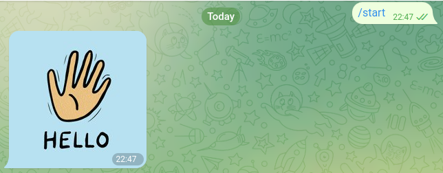
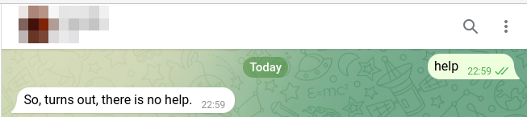

## Telegram Spring Integration

### 1) Supported functions
* send an image to user
* send a text message to user
* push a message to user from a Rest endpoint

### 2) Commands that the pot understand
* `/start`:

* `help`:

* `help chuck`:

* Rest endpoint url:
[push message to user Rest endpoint](http://localhost:8080/api/push)

### 3) Configuration

Update the values in the `application.properties` file.

